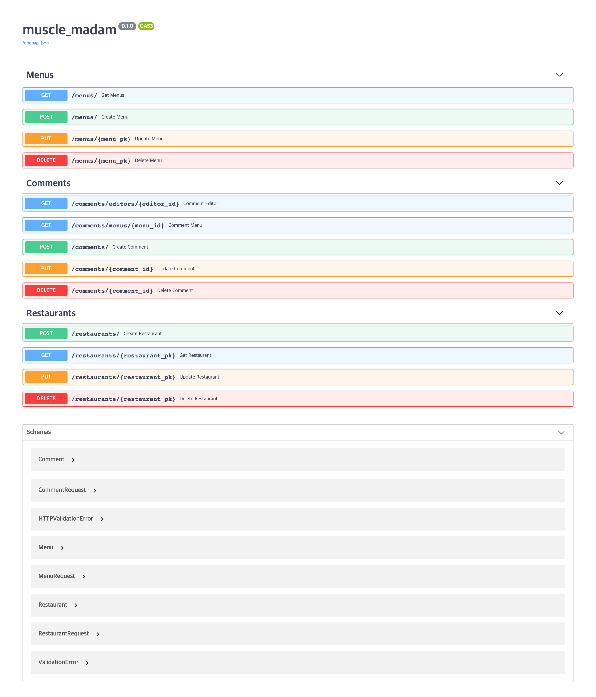

# Muscle_Madam

## REST API 사용법 🧚

### Install ###

```p
$ pip install fastapi
$ pip install uvicorn[standard]
```

### Requirements

```python
# requirements.txt
click==7.1.2
colorama==0.4.4
fastapi==0.63.0
h11==0.12.0
pydantic==1.7.3
PyMySQL==1.0.2
python-dotenv==0.15.0
python-multipart==0.0.5
PyYAML==5.3.1
six==1.15.0
SQLAlchemy==1.3.22
starlette==0.13.6
uvicorn==0.13.3
watchgod==0.6
websockets==8.1
```

### Run ###

```
$ python main.py
```

### Swagger UI (for test)

```javascript
127.0.0.1:8080/docs
```



#### API 리스트
- `Menus`
- `Comments`
- `Restaurants`

#### 스키마 리스트
- `Comment`
- `CommentRequest`
- `Menu`
- `MenuRequest`
- `Restaurant`
- `RestaurantRequest`


<br>

<hr>

<br>

## **API 별 사용법** 📝
<br>

### Menus API

1.  **전체 메뉴 조회** (success: 200 / fail: 404)

- 해당하는 메뉴가 없으면 404 리턴

```javascript
/menus/
```
`사용예제 - ajax`

```javascript
$.ajax({
    url: "/menus",
    type: "GET",
    ...
})
```

`사용예제 - axios`

```javascript
axios.get("/menus")
```

<hr>
<br>

2. **특정 메뉴 조회** (success: 200 / fail: 400 or 404)

- 세 개의 파라미터(categories/kinds/prices) 중 하나라도 없으면 400 리턴


- 해당하는 메뉴가 없으면 404 리턴

```javascript
/menus/?categores={category_pk}&...&kinds={kind_pk}&...&prices={price_pk}
```

`사용예제 - ajax`

```javascript
$.ajax({
    url: "/menus/?categories=1&categories=2&kinds=1&prices=1",
    type: "GET",
    ...
})
```

`사용예제 - axios`

```javascript
axios.get("/menus", {params:{categories:List[int], kinds:List[int], prices:List[int]}})
```

<hr>
<br>

3. **메뉴 생성** (success: 200 / fail: 400 or 422)

- 동일한 메뉴가 존재하면 400 리턴
- 데이터 형식 안 맞으면 422 리턴

```javascript
/menus/
```

`데이터 형식`

```javascript
{
  "category_pk": 0,
  "kind_pk": 0,
  "price_pk": 0,
  "restaurant_pk": 0,
  "menu_name": "string",
  "menu_price": 0,
  "menu_image": "string"
}
```

`사용예제 - ajax`

```javascript
$.ajax({
    url: "/menus",
    type: "POST",
    ...
})
```

`사용예제 - axios`

```javascript
axios.post("/menus", {data:data})
```

<hr>
<br>

4. **메뉴 업데이트** (success: 200 / fail: 404 or 422) 

- 동일한 메뉴가 존재하면 400 리턴
- 데이터 형식 안 맞으면 422 리턴 - 데이터 형식은 POST와 동일

```javascript
/menus/{menu_pk}
```

`사용예제 - ajax`

```javascript
$.ajax({
    url: "/menus/1",
    type: "PUT",
    ...
})
```

`사용예제 - axios`

```javascript
axios.put("/menus", {params:{menu_pk:int}, data:data})
```

<hr>
<br>

5. **메뉴 삭제** (success: 204 / fail: 404)

- 메뉴pk의 데이터 형식이 맞지 않거나 존재하지 않으면 404 리턴

```javascript
/menus/{menu_pk}
```

`사용예제 - ajax`

```javascript
$.ajax({
    url: "/menus/1",
    type: "DELETE",
    ...
})
```

`사용예제 - axios`

```javascript
axios.delete("/menus", {params:{menu_pk:int})
```

<hr>
<br>

### Restaurants API
1.  **식당 조회** (success: 200 / fail: 404)

- 해당하는 식당이 없으면 404 리턴

```javascript
/restaurants/{restaurant_pk}
```
`사용예제 - ajax`

```javascript
$.ajax({
    url: "/restaurants/1",
    type: "GET",
    ...
})
```

`사용예제 - axios`

```javascript
axios.get("/restaurants", {params:{restaurant_pk:int}})
```

<hr>
<br>

2. **식당 생성** (success: 200 / fail: 400 or 422)

- 동일한 식당이 존재하면 400 리턴
- 데이터 형식 안 맞으면 422 리턴

```javascript
/restaurants/
```

`데이터 형식`

```javascript
{
  "restaurant_name": "string",
  "address": "string",
  "phone_number": "string"
}
```

`사용예제 - ajax`

```javascript
$.ajax({
    url: "/restaurants",
    type: "POST",
    ...
})
```

`사용예제 - axios`

```javascript
axios.post("/restaurants", {data:data})
```

<hr>
<br>


3. **메뉴 업데이트** (success: 200 / fail: 404 or 422) 

- 동일한 메뉴가 존재하면 400 리턴
- 데이터 형식 안 맞으면 422 리턴 - 데이터 형식은 POST와 동일

```javascript
/restaurants/{restaurant_pk}
```

`사용예제 - ajax`

```javascript
$.ajax({
    url: "/menus/1",
    type: "PUT",
    ...
})
```

`사용예제 - axios`

```javascript
axios.put("/restaurants", {params:{restaurant_pk:int}, data:data})
```

<hr>
<br>

4. **식당 삭제** (success: 204 / fail: 404)

- 식당pk의 데이터 형식이 맞지 않거나 존재하지 않으면 404 리턴

```javascript
/restaurants/{restaurant_pk}
```

`사용예제 - ajax`

```javascript
$.ajax({
    url: "/restaurants/1",
    type: "DELETE",
    ...
})
```

`사용예제 - axios`

```javascript
axios.delete("/restaurants", {params:{menu_pk:int})
```

<hr>
<br>


### **Comments API**
<br>

1. **에디터 별 코멘트 조회** (success: 200 / fail: 404)

    status code 404의 경우 해당하는 에디터의 코멘트 없음

```javascript
/comments/editors/{editor_id}
```

`사용예제`
```javascript
$.ajax({
    url: "/comments/editors/1",
    type: "GET",
    ...
})
```

<hr>
<br>

2. **메뉴 별 코멘트 조회** (success: 200 / fail: 404)

    status code 404의 경우 해당 메뉴의 코멘트 없음

```javascript
/comments/menus/{menu_id}
```

`사용예제`
```javascript
$.ajax({
    url: "/comments/menus/1",
    type: "GET",
    ...
})
```

<hr>
<br>

3. **코멘트 생성** (success: 201 / fail: 409)

    status code 409의 경우, 이미 해당 메뉴에 해당 에디터가 작성한 코멘트가 존재함.
    (1인당 메뉴마다 코멘트 하나로 제한)

```javascript
/comments/
```

`사용예제`
```javascript
$.ajax({
    url: "/comments/",
    type: "POST",
    ...
})
```

<hr>
<br>

4. **코멘트 업데이트** (success: 200 / fail: 404)

    status code 404의 경우, comment_id에 해당하는 코멘트가 존재하지 않음.

```javascript
/comments/{comment_id}
```

`사용예제`
```javascript
$.ajax({
    url: "/comments/1",
    type: "PUT",
    ...
})
```


<hr>
<br>

4. **코멘트 삭제** (success: 204 / fail: 404)

    status code 404의 경우, comment_id에 해당하는 코멘트가 존재하지 않음.

```javascript
/comments/{comment_id}
```

`사용예제`
```javascript
$.ajax({
    url: "/comments/1",
    type: "DELETE",
    ...
})
```
